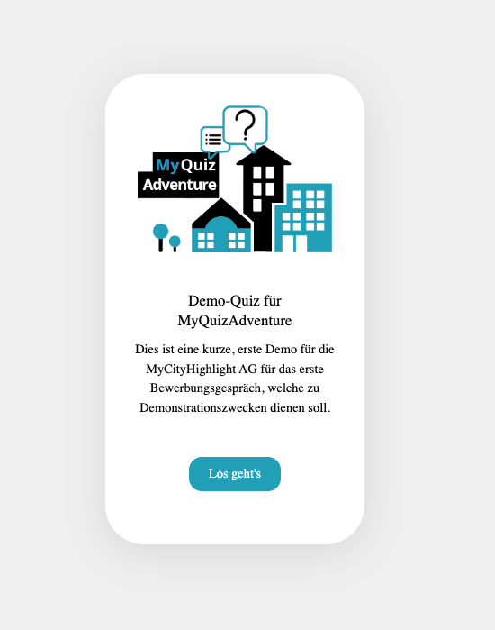
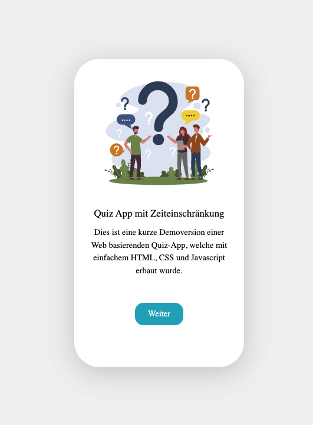
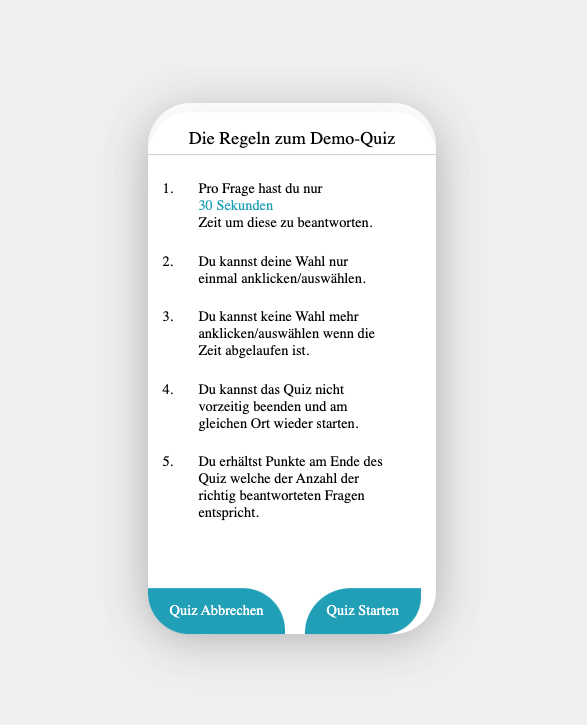
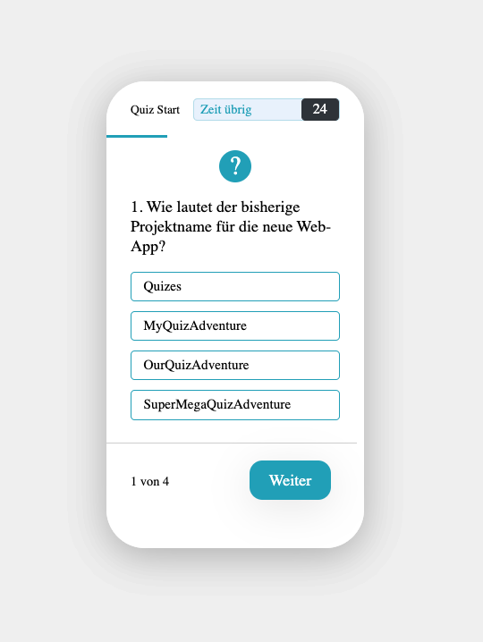
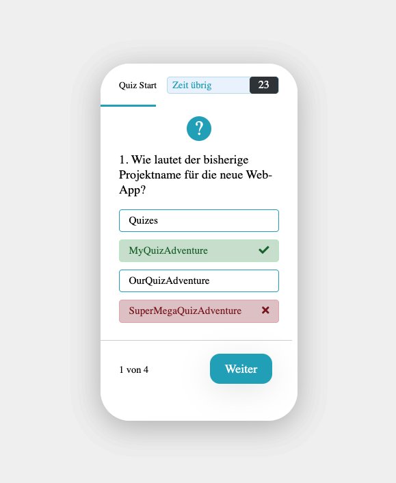
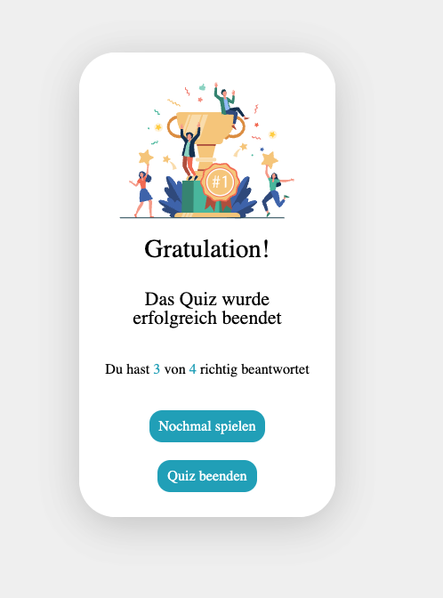

# MCH-Interview-MyQuizAdventure-Demo

This was an example of a simple quiz game that has been made for the purpose of an interview round at MyCityHighlight AG as a Full Stack Web Developer.
It uses simple HTML, CSS, Javascript and JQuery to load different aspects of the game like a timer, right or wrong, a point-system and allows users to play again or end it.

This was just a quick prototype and should not be used for any other purpose.
It was used to gauge how a developer could think of the multiple aspects of a simple game and how they would be implemented in just a few minutes and very few informations.

